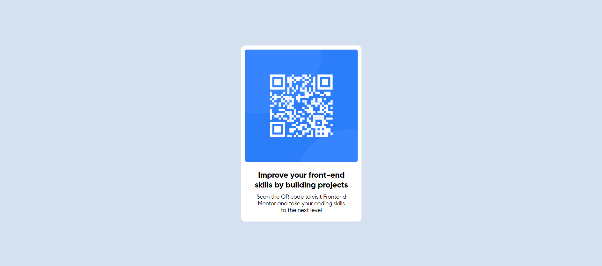

# Frontend Mentor - QR code component solution

This is a solution to the [QR code component challenge on Frontend Mentor](https://www.frontendmentor.io/challenges/qr-code-component-iux_sIO_H). Frontend Mentor challenges help you improve your coding skills by building realistic projects.

## Table of contents

-   [Overview](#overview)
    -   [Screenshot](#screenshot)
    -   [Links](#links)
-   [My process](#my-process)
    -   [Built with](#built-with)
    -   [What I learned](#what-i-learned)
    -   [Continued development](#continued-development)
    -   [Useful resources](#useful-resources)
-   [Author](#author)
-   [Acknowledgments](#acknowledgments)

## Overview

### Screenshot



### Links

-   Solution URL: [Add solution URL here](https://your-solution-url.com)
-   Live Site URL: [Add live site URL here](https://your-live-site-url.com)

## My process

### Built with

-   Semantic HTML5 markup
-   CSS custom properties
-   Flexbox
<!-- -   CSS Grid -->
-   Mobile-first workflow
<!-- -   [React](https://reactjs.org/) - JS library
-   [Next.js](https://nextjs.org/) - React framework
-   [Styled Components](https://styled-components.com/) - For styles -->

### What I learned

```html
<div class="card">
	
	<h1>Improve your front-end skills by building projects</h1>
	<p>Scan the QR code to visit Frontend Mentor and take your coding skills to the next level</p>
</div>
```

```css
.card {
	display: flex;
	flex-direction: column;
	justify-content: space-between;
	align-items: center;
	padding: 1rem;
	border-radius: 1rem;
	background-color: #fff;
	min-height: 40rem;
	width: 30rem;
}
```

### Useful resources

## Author

-   Website - [Add your name here](https://www.your-site.com)
-   Frontend Mentor - [@yourusername](https://www.frontendmentor.io/profile/Aryan9901)
-   Twitter - [@yourusername](https://www.twitter.com/Aryan9901)
